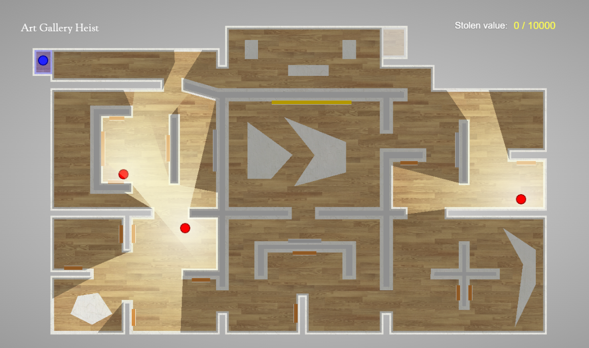

# Artgallery
This project is part of a course on Geometric Algorithms and is based on the classic [Art Gallery Problem](https://en.wikipedia.org/wiki/Art_gallery_problem). We made a game in which the player has to steal expensive paintings from an art gallery while avoiding detection by patrolling guards.

## Game
The game can be played here: [https://jeroenhoogers.github.io/artgallery/](https://jeroenhoogers.github.io/artgallery/)

## Algorithm
We implemented a 2D Visibilty algorithm using a Rotating Sweep Line method. Walls are treated as Line Segments and are sorted based on angle of the first clock-wise encountered Endpoint. The sweep line rotates CW while keeping track of all the intersected line segments sorted by distance. You can go to `Info > Debug mode` to show the inner workings of the visibilty algorithm used for the patrolling guards.

